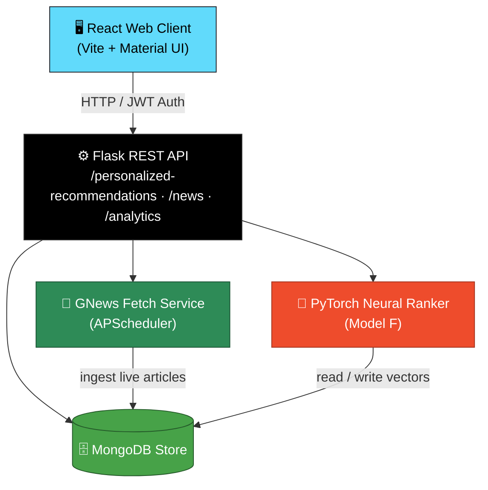
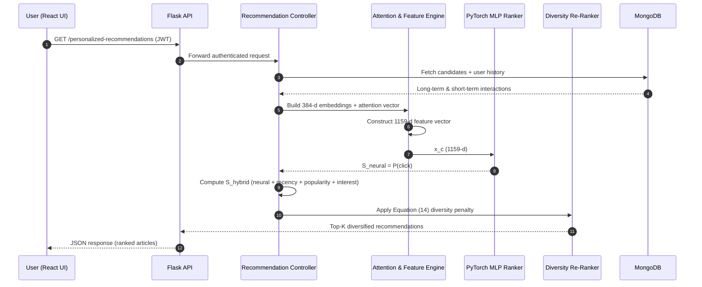
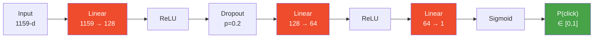

<div align="center">

# 📰 Nexora
### Context-Aware Personalized News Recommendation System
*A Deep Learning-Based Context-Aware Real-Time Personalized News Recommendation Framework*

<br/>

> A production-grade recommender engine combining dense semantic embeddings, candidate-aware attention,
> and diversity-aware neural ranking — delivered through a decoupled React + Flask architecture.

<br/>

[Overview](#2-overview) · [Features](#4-key-features) · [Architecture](#5-system-architecture) · [Pipeline](#6-recommendation-pipeline--deep-technical-explanation) · [Setup](#9-installation--setup) · [API](#12-api-documentation) · [Benchmarks](#13-research-evaluation--benchmark-results)

</div>

---

> **Naming Note:** Nexora is the branded product name for this web application. It is not the name of an algorithm or model — the underlying technical system is the **Context-Aware Personalized News Recommendation System**, formally described in the paper *"A Deep Learning-Based Context-Aware Real-Time Personalized News Recommendation Framework."*

---

## 📑 Table of Contents

- [Overview](#2-overview)
- [Problem Statement](#3-problem-statement)
- [Key Features](#4-key-features)
- [System Architecture](#5-system-architecture)
- [Recommendation Pipeline](#6-recommendation-pipeline--deep-technical-explanation)
- [Technology Stack](#7-technology-stack)
- [Repository Structure](#8-repository-structure)
- [Installation & Setup](#9-installation--setup)
- [Environment Variables](#10-environment-variables)
- [Running the Application](#11-running-the-application)
- [API Documentation](#12-api-documentation)
- [Research Evaluation & Benchmark Results](#13-research-evaluation--benchmark-results)
- [Verification & Testing](#14-verification--testing)
- [Troubleshooting & FAQs](#15-troubleshooting--faqs)
- [License & Citation](#16-license--citation)

---

## 2. Overview

In modern news streaming platforms, users face severe information overload, while publishers struggle to serve relevant content before article timeliness decays. Standard recommendation engines rely either on simple collaborative filtering — which fails on cold-start items — or static keyword matching — which ignores temporal context and user reading momentum.

The **Context-Aware Personalized News Recommendation System** (Nexora) addresses these challenges by integrating six coordinated subsystems:

| # | Component | Purpose |
| :---: | :--- | :--- |
| 1️⃣ | **Dense Semantic Embeddings** | 384-d semantic vectors for full article content |
| 2️⃣ | **Dual-Horizon User Profile** | Long-term (≤ 50 articles) + short-term (≤ 5 articles) interest modeling |
| 3️⃣ | **Candidate-Aware Softmax Attention** | Dynamically re-weights past interactions per candidate article |
| 4️⃣ | **Context Feature Engineering** | Fuses semantic similarity, recency, popularity & momentum into a 1159-d vector |
| 5️⃣ | **Lightweight MLP Neural Ranker** | 3-layer network trained with class-weighted BCE loss |
| 6️⃣ | **Diversity Re-Ranking** | Equation (14) penalty to prevent topic saturation |

Built on a **React (Vite + Material UI)** frontend and a **Flask (PyTorch + PyMongo + SentenceTransformers)** backend, the system converts raw news streams into 384-dimensional embeddings via `all-MiniLM-L6-v2`, tracks dual-horizon interaction histories, and ranks candidate articles in real time.

---

## 3. Problem Statement

| 🌊 **Information Overload** | 🔀 **Short-Term Interest Shifts** |
| :--- | :--- |
| Thousands of articles published daily across diverse categories make manual curation impossible. | Reading preference shifts dynamically between trending events and long-term hobbies. |
| ⏱️ **Extreme Item Churn & Timeliness** | 🫧 **Topic Saturation (Filter Bubbles)** |
| News becomes stale within hours — rendering offline matrix factorization unusable. | Pure accuracy-maximizing models collapse feeds into repetitive, single-category content. |

**Solution:** Couple candidate-aware neural ranking with diversity-aware post-processing to deliver accurate, context-sensitive, and diverse feeds in real time.

---

## 4. Key Features

- 🎯 **Personalized Recommendation Feed** — driven by real-time user history and attention
- 🧠 **Candidate-Aware Softmax Attention** — long-term weight $w_{\text{long}} = 0.4$, short-term weight $w_{\text{short}} = 0.6$
- 🔤 **Dense NLP Semantic Vectorization** — `SentenceTransformer("all-MiniLM-L6-v2")`
- 📐 **1159-Dimensional Feature Vector** — embeddings + attention + interaction products + 7 scalar features
- 🕸️ **PyTorch MLP Neural Ranker** — `1159 → 128 → 64 → 1` with Sigmoid output
- ⚖️ **Equation (14) Diversity Re-Ranking** — greedy category penalty, $\lambda = 0.10$
- 📡 **Automated GNews Background Fetcher** — APScheduler-driven live ingestion into MongoDB
- 🔐 **JWT Authentication & Security** — Bcrypt password hashing, stateless PyJWT sessions
- 📊 **Responsive React Dashboard** — filters, analytics, bookmarks, history, recommendation explanations
- 📈 **MIND Evaluation Suite** — benchmark scripts against Microsoft News Dataset

---

## 5. System Architecture

The system follows a decoupled client–server architecture with a dedicated AI ranking core.



### End-to-End Request Flow



---

## 6. Recommendation Pipeline — Deep Technical Explanation

The recommendation engine operates across eight algorithmic stages:

```mermaid
flowchart LR
    S1["1️⃣ Text Representation\nMiniLM → 384-d e_c"] --> S2["2️⃣ Dual-Horizon History\nLong (≤50) / Short (≤5)"]
    S2 --> S3["3️⃣ Candidate-Aware\nSoftmax Attention (τ=0.1)"]
    S3 --> S4["4️⃣ 1159-d Feature\nVector Construction"]
    S4 --> S5["5️⃣ 7 Scalar Context\nFeatures"]
    S5 --> S6["6️⃣ PyTorch MLP\nNeural Ranker"]
    S6 --> S7["7️⃣ Hybrid Scoring\nS_hybrid"]
    S7 --> S8["8️⃣ Eq.(14) Diversity\nRe-Ranking"]
    style S6 fill:#EE4C2C,color:#fff
    style S7 fill:#D63AFF,color:#fff
    style S8 fill:#47A248,color:#fff
```



### Step 1 — Text Representation

Articles are processed using pre-trained `all-MiniLM-L6-v2`, generating a dense vector from title and description:

$$\mathbf{e}_c = \text{MiniLM}(\text{Title} \parallel \text{Description}) \in \mathbb{R}^{384}$$

### Step 2 — Dual-Horizon User History

| Horizon | Symbol | Capacity | Weight |
| :--- | :---: | :---: | :---: |
| Long-Term | $H_{\text{long}}$ | ≤ 50 articles | 0.4 |
| Short-Term | $H_{\text{short}}$ | ≤ 5 articles | 0.6 |

### Step 3 — Candidate-Aware Softmax Attention

For candidate $c$, attention over history $h \in H$ uses temperature-scaled cosine similarity ($\tau = 0.1$):

$$\alpha_h = \frac{\exp\left(\cos(\mathbf{e}_c, \mathbf{e}_h)/\tau\right)}{\sum_{h' \in H} \exp\left(\cos(\mathbf{e}_c, \mathbf{e}_{h'})/\tau\right)}$$

$$\mathbf{u}_{\text{long}} = \sum_{h \in H_{\text{long}}} \alpha_h \mathbf{e}_h, \qquad \mathbf{u}_{\text{short}} = \sum_{h \in H_{\text{short}}} \alpha_h \mathbf{e}_h$$

$$\mathbf{u}(c) = 0.4 \cdot \mathbf{u}_{\text{long}} + 0.6 \cdot \mathbf{u}_{\text{short}}$$

### Step 4 — 1159-Dimensional Feature Construction

$$\mathbf{x}_c = \Big[\, \mathbf{e}_c\,(384) \;\Vert\; \mathbf{u}(c)\,(384) \;\Vert\; (\mathbf{e}_c \odot \mathbf{u}(c))\,(384) \;\Vert\; \mathbf{f}_{\text{scalar}}\,(7) \,\Big]$$

### Step 5 — Seven Scalar Context Features

| # | Feature | Description |
| :---: | :--- | :--- |
| 1 | **Semantic Score** | Cosine similarity between $\mathbf{e}_c$ and $\mathbf{u}(c)$ |
| 2 | **Context Relevance** | Temporal match to current session time |
| 3 | **Recent Category Ratio** | Share of recent reads matching candidate category |
| 4 | **Temporal Affinity** | Recency alignment of reading habits |
| 5 | **Recency** | $\text{Recency}(c) = \exp\!\left(-\dfrac{t_{\text{now}} - t_{\text{pub}}}{\tau_{\text{decay}}}\right)$ |
| 6 | **Popularity** | Normalized view/click count |
| 7 | **Interest Momentum** | Short-term reading momentum |

### Step 6 — PyTorch MLP Neural Ranker



$$S_{\text{neural}}(c,u) = P(\text{click} \mid \mathbf{x}_c)$$

### Step 7 — Hybrid Scoring

$$S_{\text{hybrid}}(c,u) = 0.60 \cdot S_{\text{neural}} + 0.20 \cdot \text{Recency} + 0.10 \cdot \text{Popularity} + 0.10 \cdot \text{Interest}$$

### Step 8 — Equation (14) Diversity Re-Ranking

$$S'(c) = S_{\text{hybrid}}(c,u) - \lambda \cdot P(c,R), \qquad \lambda = 0.10$$

$$P(c,R) = \frac{\text{count of category}(c)\text{ in selected set } R}{\max(1,\,|R|)}$$

---

## 7. Technology Stack

| Layer | Technology / Library | Version / Details |
| :--- | :--- | :--- |
| 🖼️ **Frontend UI** | React, Vite | React 19, Vite 8 |
| 🧩 **Component Library** | Material UI (MUI), Framer Motion | MUI 9, Framer Motion 12 |
| 📊 **Data Visualization** | Chart.js, React-ChartJS-2 | Chart.js 4 |
| ⚙️ **Backend Framework** | Python, Flask, Waitress | Flask 3.1, Waitress WSGI |
| 🗄️ **Database & ORM** | MongoDB, PyMongo | MongoDB 4.4+, PyMongo 4.17 |
| 🧠 **Deep Learning** | PyTorch | PyTorch 2.x |
| 🔤 **NLP Embeddings** | SentenceTransformers | `all-MiniLM-L6-v2` (384-dim) |
| 🔬 **Scientific Computing** | NumPy, SciPy, Scikit-Learn | NumPy 2.5, SciPy 1.14 |
| 🔐 **Authentication** | PyJWT, Bcrypt | JWT Stateless Sessions |
| ⏰ **Task Scheduling** | APScheduler | Background GNews Ingestion |

---

## 8. Repository Structure

```text
News_Recommendation_System/
├── backend/
│   ├── app/
│   │   ├── ai/                        # Recommendation AI core
│   │   │   ├── attention_service.py   # Candidate-aware softmax attention
│   │   │   ├── context_service.py     # Temporal & scalar feature extraction
│   │   │   ├── diversity_service.py   # Eq. (14) diversity reranking
│   │   │   ├── embedding_service.py   # SentenceTransformer embeddings
│   │   │   ├── feature_extractor.py   # 1159-d vector builder
│   │   │   ├── neural_ranker.py       # PyTorch MLP Neural Ranker model
│   │   │   ├── ranking_service.py     # Base scoring & hybrid fusion
│   │   │   ├── recommendation_service.py # End-to-end pipeline coordinator
│   │   │   └── user_profile_service.py   # Dual-horizon profile generator
│   │   ├── config/                    # Environment & database settings
│   │   ├── controllers/               # API endpoint request handlers
│   │   ├── database/                  # MongoDB connection client
│   │   ├── models/                    # PyMongo schemas
│   │   ├── routes/                    # Flask REST API route definitions
│   │   ├── services/                  # Business logic & GNews ingestion
│   │   └── utils/                     # JWT helpers & formatters
│   ├── evaluation/
│   │   └── mind/                      # Research evaluation scripts & benchmark outputs
│   │       ├── data/                  # MIND dataset (behaviors.tsv, news.tsv)
│   │       ├── cache/                 # Pre-computed news embeddings & metadata
│   │       └── final_research_results_step2.json
│   ├── models/
│   │   └── neural_ranker/
│   │       ├── neural_ranker.pt       # Trained PyTorch weights (630 KB)
│   │       └── model_config.json      # Model architecture configuration (21 KB)
│   ├── scripts/                       # System verification & testing scripts
│   ├── tests/                         # Unit tests
│   ├── requirements.txt
│   ├── run.py                         # Development server launcher
│   ├── start_server.py                # Waitress WSGI production server
│   └── wsgi.py                        # WSGI entry point
├── frontend/
│   ├── public/                        # Static assets & icons
│   ├── src/
│   │   ├── components/                # Modular React UI components
│   │   ├── context/                   # Auth & Theme React contexts
│   │   ├── pages/                     # Application pages
│   │   ├── routes/                    # React Router definitions
│   │   └── services/                  # Axios HTTP API services
│   ├── .env.example
│   ├── index.html
│   ├── package.json
│   └── vite.config.js
├── .env.example
├── .gitignore
└── README.md
```

---

## 9. Installation & Setup

### ✅ Prerequisites

| Requirement | Version |
| :--- | :--- |
| Python | 3.10+ |
| Node.js | 18.x+ (npm included) |
| MongoDB | Local instance (`mongodb://localhost:27017`) or Atlas URI |

### Step 1 — Clone Repository

```bash
git clone https://github.com/your-username/News_Recommendation_System.git
cd News_Recommendation_System
```

### Step 2 — Backend Setup

```bash
cd backend

# Create & activate virtual environment
python3 -m venv venv
source venv/bin/activate        # Windows: .\venv\Scripts\activate

# Install dependencies
pip install -r requirements.txt

# Configure environment
cp ../.env.example ../.env
```

> Adjust `.env` parameters as needed (`MONGO_URI`, `SECRET_KEY`, `GNEWS_API_KEY`).

### Step 3 — Frontend Setup

```bash
cd frontend
npm install
cp .env.example .env
# Ensure VITE_API_URL=http://127.0.0.1:5000
```

---

## 10. Environment Variables

**Backend `.env`**
```ini
SECRET_KEY=your_secure_jwt_secret_key
DEBUG=True
MONGO_URI=mongodb://localhost:27017/news_recommendation_db
GNEWS_API_KEY=your_gnews_api_key_here
USE_NEURAL_RANKER=True
```

**Frontend `frontend/.env`**
```ini
VITE_API_URL=http://127.0.0.1:5000
```

---

## 11. Running the Application

**🧪 Option A — Development Mode**

```bash
# Terminal 1 — Backend
cd backend
python run.py
# → http://127.0.0.1:5000

# Terminal 2 — Frontend
cd frontend
npm run dev
# → http://localhost:5173
```

**🚀 Option B — Production Mode (Waitress)**

```bash
# Backend
cd backend
python start_server.py     # Multi-threaded Waitress on :5000

# Frontend
cd frontend
npm run build
npm run preview
```

---

## 12. API Documentation

| Method | Endpoint | Access | Description |
| :---: | :--- | :---: | :--- |
| `POST` | `/register` | 🌐 Public | Register new user account |
| `POST` | `/login` | 🌐 Public | Authenticate user & return JWT token |
| `GET` | `/profile` | 🔒 Protected | Fetch current user profile |
| `POST` | `/reset-password` | 🌐 Public | Reset user password |
| `GET` | `/personalized-recommendations` | 🔒 Protected | Fetch AI-personalized news recommendations |
| `GET` | `/recommendations/<news_id>` | 🌐 Public | Fetch related articles for a given news item |
| `GET` | `/news` | 🌐 Public | Retrieve article feed with category filtering |
| `GET` | `/news/<id>` | 🌐 Public | Retrieve single article content |
| `GET` | `/news/search` | 🌐 Public | Search articles by keyword |
| `POST` | `/reading-history/<news_id>` | 🔒 Protected | Record article read event into user history |
| `GET` | `/bookmarks` | 🔒 Protected | List user bookmarked articles |
| `POST` | `/bookmark/<news_id>` | 🔒 Protected | Add article to user bookmarks |
| `DELETE` | `/bookmark/<news_id>` | 🔒 Protected | Remove article from user bookmarks |
| `GET` | `/trending` | 🌐 Public | Retrieve trending news articles |
| `GET` | `/analytics` | 🔒 Protected | Fetch user analytics & interest breakdown |

---

## 13. Research Evaluation & Benchmark Results

Benchmarked on the **Microsoft News Dataset (MIND)** — $N = 500$ test users, 1,432 impression sessions — comparing the Baseline Heuristic (Model E) against the Proposed Neural Ranker (Model F), as described in *"A Deep Learning-Based Context-Aware Real-Time Personalized News Recommendation Framework."*

<div align="center">

| Metric | Baseline (E) | Neural Ranker (F) | Absolute Gain | Relative Gain | Significance |
| :---: | :---: | :---: | :---: | :---: | :---: |
| **AUC** | 0.6427 | 🟢 **0.6998** | +0.0571 | **+8.88%** | $p < 0.001$ ($t = 6.26$) |
| **MRR@10** | 0.3551 | 🟢 **0.3904** | +0.0353 | **+9.94%** | $p < 0.001$ ($t = 3.46$) |
| **NDCG@10** | 0.4119 | 🟢 **0.4423** | +0.0304 | **+7.38%** | $p < 0.001$ ($t = 3.55$) |
| **ILD@10** | 0.8959 | 🟢 **0.9296** | +0.0337 | **+3.76%** | $p < 0.001$ ($t = 25.32$) |

</div>

> **Statistical Note:** All metrics show statistically significant improvements ($p < 0.001$) under two-tailed paired $t$-tests with Holm–Bonferroni FWER correction.

```mermaid
xychart-beta
    title "Model E (Baseline) vs Model F (Neural Ranker)"
    x-axis ["AUC", "MRR@10", "NDCG@10", "ILD@10"]
    y-axis "Score" 0 --> 1
    bar [0.6427, 0.3551, 0.4119, 0.8959]
    bar [0.6998, 0.3904, 0.4423, 0.9296]
```



---

## 14. Verification & Testing

```bash
# Run backend integration tests
cd backend
python -m unittest discover -s tests

# Run end-to-end backend verification
python scripts/run_all_tests.py
```

---

## 15. Troubleshooting & FAQs

<details>
<summary><strong>Q1: MongoDB Connection Error (<code>ServerSelectionTimeoutError</code>)</strong></summary>
<br/>

**Cause:** Local MongoDB service is not running, or an invalid `MONGO_URI` was supplied.

**Solution:**
- Windows: `net start MongoDB`
- Linux: `sudo systemctl start mongod`
- Double-check the connection string in `.env`

</details>

<details>
<summary><strong>Q2: SentenceTransformer Model Download Hangs</strong></summary>
<br/>

**Cause:** Network restriction during initial download of `all-MiniLM-L6-v2`.

**Solution:** Ensure internet access on first launch. The model is cached locally under `~/.cache/huggingface/hub/` after the first download.

</details>

<details>
<summary><strong>Q3: Recommendations return generic popular items</strong></summary>
<br/>

**Cause:** User interaction history is empty (Cold-Start Mode).

**Solution:** Read or click several articles to build short-term and long-term history embeddings. The neural ranker activates once history embeddings are available.

</details>

---

## 16. License & Citation

<div align="center">

This project is licensed under the **MIT License**.

</div>

If you use this system or its research benchmark in your work, please cite:

```bibtex
@article{nexora2026recommendation,
  title={A Deep Learning-Based Context-Aware Real-Time Personalized News Recommendation Framework},
  author={},
  year={2026}
}
```

---

<div align="center">

Made with 🧠 + ☕ · Nexora

[⬆ Back to top](#-nexora)

</div>